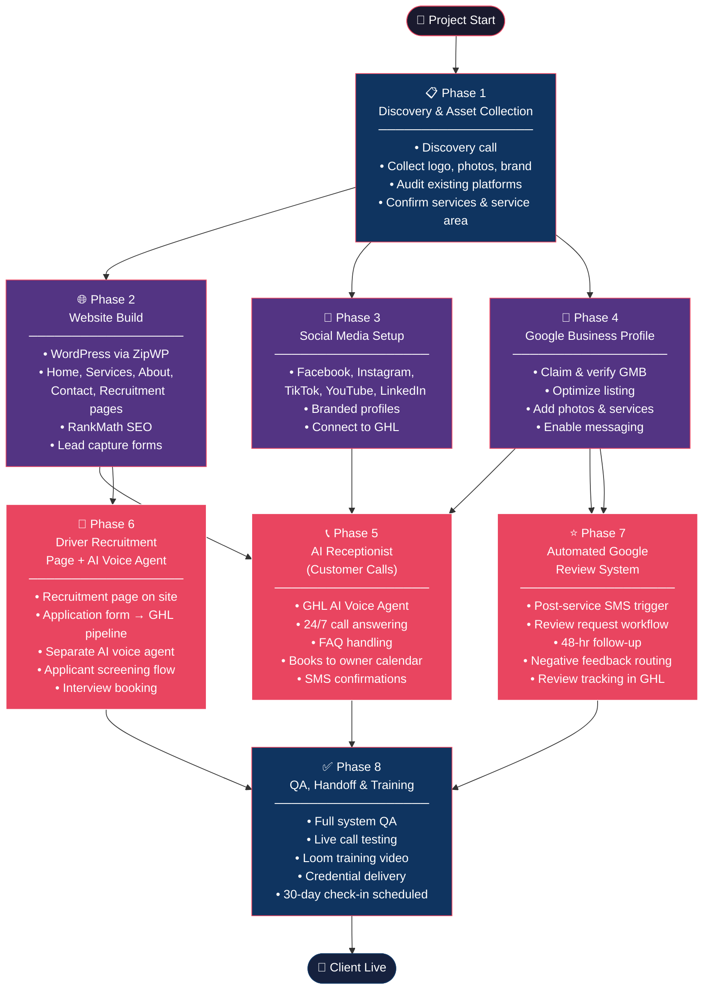

# Tick Tock Towing — Client Project

**Managed by:** Mbusiness Branding AI
**Client:** Tick Tock Towing
**Industry:** Towing & Roadside Assistance
**Goal:** Full AI-powered digital infrastructure — lead generation, driver recruiting, call handling, and online reputation.

---

## Project Flowchart

---

## Business Profile

| Field | Value |
|-------|-------|
| **Business Name** | Tick Tock Towing |
| **Industry** | Towing / Roadside Assistance |
| **Service Area** | TBD — confirm with client |
| **Owner Name** | TBD |
| **Owner Phone** | TBD |
| **Owner Email** | TBD |
| **Booking Calendar** | TBD — connect to GHL |
| **Existing Website** | TBD |
| **Existing Social Media** | TBD — audit on discovery call |
| **Google Business Profile** | TBD |

---

## Roadmap Overview

| Phase | Deliverable | Status |
|-------|------------|--------|
| 1 | Discovery & Asset Collection | `[~]` |
| 2 | Website Build | `[~]` |
| 3 | Social Media Setup | `[ ]` |
| 4 | Google Business Profile | `[ ]` |
| 5 | AI Receptionist (Customer Calls) | `[ ]` |
| 6 | Driver Recruitment Page + AI Voice Agent | `[ ]` |
| 7 | Automated Google Review System | `[ ]` |
| 8 | QA, Handoff & Training | `[ ]` |

---

## Phase 1 — Discovery & Asset Collection

**Goal:** Gather everything needed before building anything.

### Checklist
- `[ ]` Complete discovery call with client
- `[ ]` Collect logo (vector preferred) and brand colors
- `[ ]` Collect photos (trucks, team, job site)
- `[ ]` Confirm service area (cities/zip codes)
- `[ ]` Confirm services offered (towing, roadside, winching, etc.)
- `[ ]` Audit existing website (if any)
- `[ ]` Audit existing social accounts (document handles + login access)
- `[ ]` Confirm owner calendar platform (Google, Outlook, etc.)
- `[ ]` Confirm phone number to be used for AI receptionist
- `[ ]` Get access to Google Business Profile (or confirm none exists)

---

## Phase 2 — Website Build

**Goal:** Professional, mobile-first WordPress website focused on lead capture and local SEO.

### Pages
- **Home** — Hero with call-to-action, services overview, trust signals, reviews widget
- **Services** — Full list of towing and roadside services with descriptions
- **About** — Story, team, local trust-building
- **Contact / Book Now** — Lead capture form + live call button
- **Driver Recruitment** — Separate page for job applicants (see Phase 6)

### Tech
- Platform: WordPress via ZipWP
- Theme: Astra
- SEO: RankMath
- Forms: GHL-embedded or Fluent Forms → GHL

### Checklist
- `[ ]` Create ZipWP site + connect domain
- `[ ]` Install Astra theme + RankMath
- `[ ]` Build Home page
- `[ ]` Build Services page
- `[ ]` Build About page
- `[ ]` Build Contact / Book Now page
- `[ ]` Configure RankMath — title, meta, schema (LocalBusiness)
- `[ ]` Add Google Analytics / Tag Manager
- `[ ]` Mobile QA pass
- `[ ]` Speed test (target: 90+ PageSpeed score)

---

## Phase 3 — Social Media Setup

**Goal:** Create and brand all major social media platforms with consistent identity.

### Platforms
- Facebook Business Page
- Instagram Business Account
- TikTok Business Account
- YouTube Channel
- LinkedIn Business Page (optional — confirm with client)

### Checklist
- `[ ]` Create / claim each platform account
- `[ ]` Upload logo as profile photo on all platforms
- `[ ]` Write consistent bio/description across all platforms
- `[ ]` Add website URL and contact info to each profile
- `[ ]` Create branded cover photos (truck imagery + tagline)
- `[ ]` Pin an introductory post on Facebook
- `[ ]` Connect all platforms to GHL for future posting
- `[ ]` Document all handles in this file

---

## Phase 4 — Google Business Profile (GMB)

**Goal:** Claim, verify, and fully optimize the Google Business Profile for local search dominance.

### Checklist
- `[ ]` Claim or create Google Business Profile
- `[ ]` Verify listing (phone or postcard)
- `[ ]` Add all services with descriptions
- `[ ]` Add photos (exterior, trucks, team)
- `[ ]` Set business hours
- `[ ]` Add service area (cities/zip codes)
- `[ ]` Write keyword-rich business description
- `[ ]` Set primary category: "Towing Service"
- `[ ]` Add secondary categories (Roadside Assistance, etc.)
- `[ ]` Enable messaging
- `[ ]` Connect to review automation (Phase 7)

---

## Phase 5 — AI Receptionist (Customer Calls)

**Goal:** Deploy 24/7 AI voice agent to answer customer calls, handle FAQs, and book appointments directly to the owner's calendar.

### Capabilities
- Answer inbound calls 24/7
- Collect caller name, phone, location, service needed
- Book tow/service appointments to owner's calendar
- Handle after-hours calls with callback scheduling
- Transfer to live agent when needed

### Tech
- Platform: GHL AI Voice Agent
- Calendar: Owner's Google/Outlook calendar via GHL
- Phone number: Forward or replace main business line

### Checklist
- `[ ]` Set up GHL sub-account for Tick Tock Towing
- `[ ]` Configure GHL phone number (or forward existing)
- `[ ]` Build AI voice agent script (greeting, FAQ, booking flow)
- `[ ]` Connect calendar in GHL (owner's booking availability)
- `[ ]` Test call flows — booking, FAQ, after-hours
- `[ ]` Set up SMS confirmation to caller after booking
- `[ ]` Set up internal notification to owner on new booking
- `[ ]` Go live — update Google Business Profile with AI number

---

## Phase 6 — Driver Recruitment Page + AI Voice Agent

**Goal:** Attract driver applicants via a dedicated recruitment page and automate applicant screening with a separate AI voice agent.

### Website — Driver Recruitment Page
- Headline: "Drive With Tick Tock Towing"
- Requirements listed (license class, experience, etc.)
- Benefits listed (pay, flexibility, etc.)
- Simple application form: name, phone, email, license type, experience, availability
- Form submits to GHL pipeline (Recruiting)

### AI Voice Agent (Applicant Calls)
- Separate GHL number from customer line
- Answers calls from potential drivers
- Collects: name, license type, years experience, availability
- Screens for basic qualifications
- Books a follow-up interview with owner (or flags unqualified)
- Sends SMS confirmation with next steps

### Checklist
- `[ ]` Build Driver Recruitment page on website
- `[ ]` Create application form → GHL pipeline
- `[ ]` Set up separate GHL number for recruiting line
- `[ ]` Build AI voice agent script for applicant screening
- `[ ]` Create GHL pipeline: Recruiting (Applied → Screened → Interview → Hired/Rejected)
- `[ ]` Test applicant call flow
- `[ ]` Set up owner notification on new applicant
- `[ ]` Add recruiting phone number to Recruitment page

---

## Phase 7 — Automated Google Review System

**Goal:** Consistently generate 5-star Google reviews through automated post-service follow-up.

### Flow
1. Service completed → owner marks job done in GHL (or trigger via form/tag)
2. GHL sends SMS to customer: "Thanks for choosing Tick Tock Towing! Mind leaving us a quick review?" + Google review link
3. If no response in 48 hours → send follow-up SMS
4. If negative feedback detected → route to owner for personal follow-up (not posted publicly)
5. Positive reviews tracked in GHL dashboard

### Checklist
- `[ ]` Build GHL workflow: Job Complete trigger → SMS review request
- `[ ]` Get Google review short link from GMB
- `[ ]` Write 2–3 SMS review request templates
- `[ ]` Set up 48-hour follow-up SMS
- `[ ]` Configure negative feedback routing (internal flag)
- `[ ]` Test full review flow end-to-end
- `[ ]` Train owner on how to trigger review request

---

## Phase 8 — QA, Handoff & Training

**Goal:** Validate everything works, train the owner, and deliver a clean handoff.

### Checklist
- `[ ]` Full QA pass — website, all forms, all automations
- `[ ]` Test AI receptionist with real calls
- `[ ]` Test driver recruitment flow end-to-end
- `[ ]` Confirm Google Business Profile is live and optimized
- `[ ]` Record Loom training video for owner
- `[ ]` Deliver credentials doc (passwords, platform access)
- `[ ]` Schedule 30-day check-in call

---

## Notes & Decisions

- **2026-03-15** — Site is live as **static HTML on Hostinger** at https://tiktoktowing.mbusinessbrandingai.com/ (not WordPress). Files: `index.html`, `careers.html`, `blog.html`, `assets/`. Deploy updates via Hostinger MCP (`hosting_deployStaticWebsite`, domain: `tiktoktowing.mbusinessbrandingai.com`).
- **2026-03-15** — Blog page created with 5 safety tip posts (emergency roadside assistance keywords). Blog link added to nav on all pages.
- **Platform decision** — Keeping static HTML until discovery call is complete and client confirms need for self-managed CMS. WordPress migration can happen in a later phase if needed.

---

## Credentials Reference

Store all logins in `/Clients/TicTokTowing/credentials.md` — do NOT commit that file to git.
